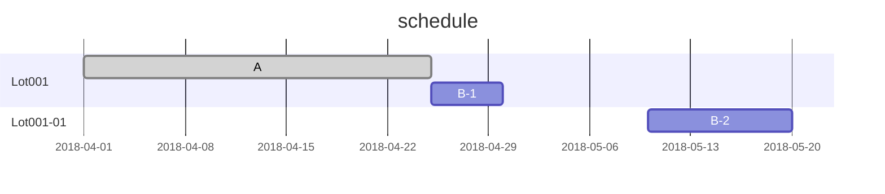
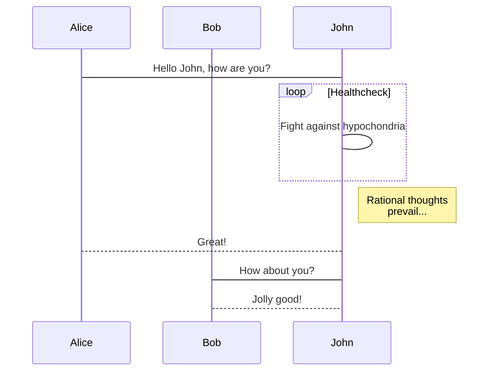

# Example

## 1. Markdown Extension

This application uses Marked.js and highlight.js to render Markdown.

Marked.js supported

|Flavor|Version|
|:--|:--|
|The original markdown.pl|--|
|CommonMark|0.28|
|GitHub Flavored Markdown|0.28|

And, the following expansion is done for Printing PDF.

### 1-1. Header/Footer

Header parameters are listed in code blocks. To enable it write Info String to ```header```.

> \`\`\`header  
> {  
>  "title"   : "title name",  
>  "no"      : "document no.",  
>  "caution" : "watermark character"  
> }  
>  \`\`\`

```header
{
  "title"   : "Example.md",
  "no"      : "ver 0.0.1",
  "caution" : "watermark"
}
```

### 1-2. Page break

Horizontal Rule ( blank lines ) is replaced by Page break.

```
***
```

***

## 2. Mermaid

Create diagrams in markdown using mermaid code blocks:

> \`\`\`mermaid
> [code]
>  \`\`\`

### 2-1. flowchart

```
graph TD;
    A-->B;
    A-->C;
    B-->D;
    C-->D;
```


***

### 2-2. gantt

```
gantt
  dateFormat YYYY-MM-DD
  title schedule
  section Lot001
    A   : done, 001_A, 2018-04-01 , 2018-04-25
    B-1 :       001_B, after 001_A, 2018-04-30
  section Lot001-01
    B-2 :       001_C, 2018-05-10 , 2018-05-20
```



***

### 2-3. sequence diagram

```
sequenceDiagram
    participant Alice
    participant Bob
    Alice->John: Hello John, how are you?
    loop Healthcheck
        John->John: Fight against hypochondria
    end
    Note right of John: Rational thoughts <br/>prevail...
    John-->Alice: Great!
    John->Bob: How about you?
    Bob-->John: Jolly good!
```



***

## 3. WfMap

Create diagrams in markdown using WfMap.js code blocks:

> \`\`\`wfmap  
> [code]  
>  \`\`\`  

### 3-1. An example

```wfmap
{
  "title" : "Wf01",
  "config" : {
    "wfsize" : 200,
    "offsetX" : 12.2,
    "offsetY" : 4.0,
    "chipSizeX" : 24.8,
    "chipSizeY" : 17.2,
    "countX" : 9,
    "countY" : 12,
    "edge" : 5,
    "notch" : 9,
    "notchside" : 0
  },
  "legend" : {
    "mode" : "mark",
    "mark" : {
      "1" : {
        "text" : "組立",
        "mark" : "o",
        "color" : "red",
        "background" : "gray"
      },
      "2" : {
        "text" : "組立済",
        "mark" : "x",
        "color" : "red",
        "background" : "white"
      },
      "3" : {
        "text" : "未組立",
        "mark" : "△",
        "color" : "red",
        "background" : "lightgray"
      }
    }
  },
  "chip": [
    {"y" : 1, "x": 3, "value": 1},
    {"y" : 1, "x": 4, "value": 2},
    {"y" : 1, "x": 5, "value": 42, "background" : "black"},
    {"y" : 2, "x": 2, "value": 43},
    {"y" : 2, "x": 3, "value": 41},
    {"y" : 2, "x": 4, "value": 2},
    {"y" : 2, "x": 5, "value": 21},
    {"y" : 2, "x": 6, "value": 5},
    {"y" : 3, "x": 2, "value": 6},
    {"y" : 3, "x": 3, "value": 20},
    {"y" : 3, "x": 4, "value": 3},
    {"y" : 3, "x": 5, "value": 40},
    {"y" : 3, "x": 6, "value": 44},
    {"y" : 4, "x": 7, "value": 54},
    {"y" : 4, "x": 6, "value": 45},
    {"y" : 4, "x": 5, "value": 39}
  ]
}
```

```wfmap
{
  "title" : "Wf02",
  "caution" : "DRAFT",
  "config" : {
    "wfsize" : 200,
    "offsetX" : 12.2,
    "offsetY" : 4.0,
    "chipSizeX" : 24.8,
    "chipSizeY" : 17.2,
    "countX" : 9,
    "countY" : 12,
    "edge" : 5,
    "notch" : 9,
    "notchside" : 0
  },
  "legend" : {
    "mode" : "colorscale",
    "colorscale" : {
      "domain": [5,60],
      "range":["green","red"]
    }
  },
  "chip": [
    {"y" : 1, "x": 3, "value": 22},
    {"y" : 1, "x": 4, "value": 23},
    {"y" : 1, "x": 5, "value": 42, "background" : "black"},
    {"y" : 2, "x": 2, "value": 43},
    {"y" : 2, "x": 3, "value": 41},
    {"y" : 2, "x": 4, "value": 24},
    {"y" : 2, "x": 5, "value": 21},
    {"y" : 2, "x": 6, "value": 5},
    {"y" : 3, "x": 2, "value": 6},
    {"y" : 3, "x": 3, "value": 20},
    {"y" : 3, "x": 4, "value": 25},
    {"y" : 3, "x": 5, "value": 40},
    {"y" : 3, "x": 6, "value": 44},
    {"y" : 4, "x": 7, "value": 54},
    {"y" : 4, "x": 6, "value": 45},
    {"y" : 4, "x": 5, "value": 39}
  ]
}
```
