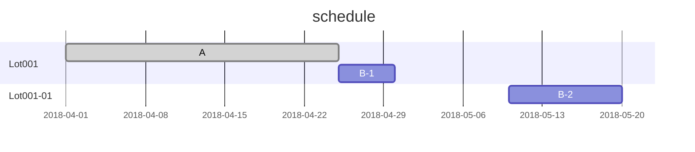

# WELCOME

## schedule



- 1st Lot is already up.
- I have to give instructions to the next process.

## Lot Summay

```wfmap
{
  "title" : "Wf01",
  "config" : {
    "wfsize" : 200,
    "offsetX" : 12.2,
    "offsetY" : 4.0,
    "chipSizeX" : 24.8,
    "chipSizeY" : 17.2,
    "countX" : 9,
    "countY" : 12,
    "edge" : 5,
    "notch" : 9,
    "notchside" : 0
  },
  "legend" : {
    "mode" : "mark",
    "mark" : {
      "1" : {
        "text" : "組立",
        "mark" : "o",
        "color" : "red",
        "background" : "gray"
      },
      "2" : {
        "text" : "組立済",
        "mark" : "x",
        "color" : "red",
        "background" : "white"
      },
      "3" : {
        "text" : "未組立",
        "mark" : "△",
        "color" : "red",
        "background" : "lightgray"
      }
    }
  },
  "chip": [
    {"y" : 1, "x": 3, "value": 1},
    {"y" : 1, "x": 4, "value": 2},
    {"y" : 1, "x": 5, "value": 42, "background" : "black"},
    {"y" : 2, "x": 2, "value": 43},
    {"y" : 2, "x": 3, "value": 41},
    {"y" : 2, "x": 4, "value": 2},
    {"y" : 2, "x": 5, "value": 21},
    {"y" : 2, "x": 6, "value": 5},
    {"y" : 3, "x": 2, "value": 6},
    {"y" : 3, "x": 3, "value": 20},
    {"y" : 3, "x": 4, "value": 3},
    {"y" : 3, "x": 5, "value": 40},
    {"y" : 3, "x": 6, "value": 44},
    {"y" : 4, "x": 7, "value": 54},
    {"y" : 4, "x": 6, "value": 45},
    {"y" : 4, "x": 5, "value": 39}
  ]
}
```

```wfmap
{
  "title" : "Wf02",
  "caution" : "DRAFT",
  "config" : {
    "wfsize" : 200,
    "offsetX" : 12.2,
    "offsetY" : 4.0,
    "chipSizeX" : 24.8,
    "chipSizeY" : 17.2,
    "countX" : 9,
    "countY" : 12,
    "edge" : 5,
    "notch" : 9,
    "notchside" : 0
  },
  "legend" : {
    "colorscale" : {
      "domain": [5,60],
      "range":["green","red"]
    }
  },
  "chip": [
    {"y" : 1, "x": 3, "value": 22},
    {"y" : 1, "x": 4, "value": 23},
    {"y" : 1, "x": 5, "value": 42, "background" : "black"},
    {"y" : 2, "x": 2, "value": 43},
    {"y" : 2, "x": 3, "value": 41},
    {"y" : 2, "x": 4, "value": 24},
    {"y" : 2, "x": 5, "value": 21},
    {"y" : 2, "x": 6, "value": 5},
    {"y" : 3, "x": 2, "value": 6},
    {"y" : 3, "x": 3, "value": 20},
    {"y" : 3, "x": 4, "value": 25},
    {"y" : 3, "x": 5, "value": 40},
    {"y" : 3, "x": 6, "value": 44},
    {"y" : 4, "x": 7, "value": 54},
    {"y" : 4, "x": 6, "value": 45},
    {"y" : 4, "x": 5, "value": 39}
  ]
}
```

***

## This document

This documentation is written in GitHub Flavored Markdown (GFM) expanded with mermaid and wfmapEditor.

```wfmap
{
  "title" : "Wf02",
  "caution" : "DRAFT",
  "config" : {
    "wfsize" : 200,
    "offsetX" : 12.2,
    "offsetY" : 4.0,
    "chipSizeX" : 24.8,
    "chipSizeY" : 17.2,
    "countX" : 9,
    "countY" : 12,
    "edge" : 5,
    "notch" : 9,
    "notchside" : 0
  },
  "legend" : {
    "colorscale" : {
      "domain": [5,60],
      "range":["green","red"]
    }
  },
  "chip": [
    {"y" : 1, "x": 3, "value": 22},
    {"y" : 1, "x": 4, "value": 23},
    {"y" : 1, "x": 5, "value": 42, "background" : "black"},
    {"y" : 2, "x": 2, "value": 43},
    {"y" : 2, "x": 3, "value": 41},
    {"y" : 2, "x": 4, "value": 24},
    {"y" : 2, "x": 5, "value": 21},
    {"y" : 2, "x": 6, "value": 5},
    {"y" : 3, "x": 2, "value": 6},
    {"y" : 3, "x": 3, "value": 20},
    {"y" : 3, "x": 4, "value": 25},
    {"y" : 3, "x": 5, "value": 40},
    {"y" : 3, "x": 6, "value": 44},
    {"y" : 4, "x": 7, "value": 54},
    {"y" : 4, "x": 6, "value": 45},
    {"y" : 4, "x": 5, "value": 39}
  ]
}
```

***

aa

***

bb
